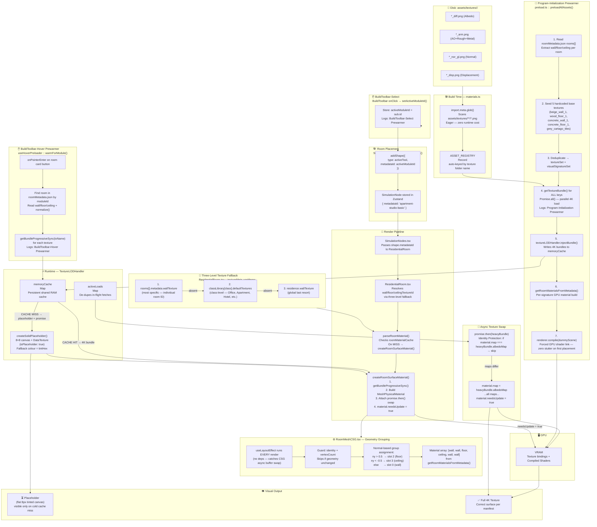

# Texture Pipeline — Directed Acyclic Graph (DAG)

> **IMPORTANT: DO NOT DELETE.** This is the canonical reference for the Villaggio Terrace texture loading architecture.
> **Updated**: 2026-04-20 (Phase 3.5.2 — Verified Operational)

---

## 1. Full Pipeline DAG



---

## 2. Hardcoded vs. Manifest-Driven Textures

| Room Type | Source | Notes |
|---|---|---|
| **Lobby** | `getLobbyMaterials()` — hardcoded | `grey_cartago_tiles` must stay in `preload.ts` base seed |
| **Empty Floor** | `getEmptyFloorMaterials()` — hardcoded | Must be in base seed |
| **Structure/Scaffold** | `getStructuralConcreteMaterials()` — hardcoded | Must be in base seed |
| **Apartment / Hotel / Restaurant / Store / Services / FootTraffic / Office** | `roomMetadata.json` | Per-room entry → class default → global fallback |

### Hardcoded Base Seed (`preload.ts` lines 34–39)
These must always be present. They cover rooms that have no `roomMetadata.json` entry:
```
beige_wall_1        — generic fallback / Apartment class / Lobby walls
wood_floor_1        — generic fallback / Apartment class
concrete_wall_1     — EmptyFloor / Structural / Office class
concrete_floor_1    — EmptyFloor / Structural / Office class
grey_cartago_tiles  — Lobby floor (getLobbyMaterials())
```

---

## 3. Prewarmer Summary Table

| # | Prewarmer | Trigger | Hardcoded or Dynamic | Log Prefix |
|---|---|---|---|---|
| 1 | **Program-Initialization** | App boot (once) | **Both** — 5 hardcoded base + all manifest rooms[] | `[Program-Initialization Prewarmer]` |
| 2 | **BuildToolbar-Hover** | Mouse enter on room card | **Dynamic** — reads room's textures from manifest | `[BuildToolbar-Hover Prewarmer] Module: X | Textures: [...]` |
| 3 | **BuildToolbar-Select** | Click room card | Log only — no new loads | `[BuildToolbar-Select Prewarmer] Module selected: X` |

---

## 4. Visual Failure Cues

| Symptom | Probable Cause |
|---|---|
| All room faces show same flat beige | CSG grouping not applying (check layout effect fires after CSG) |
| Lobby floor is grey/concrete not tiled | `grey_cartago_tiles` missing from `preload.ts` base seed |
| Textures never upgrade from placeholder | Promise swap detached — check `createRoomSurfaceMaterial` `.then()` handler |
| All rooms identical texture despite different IDs | `metadataId` not piped from `SimulationNodes` → `ResidentialRoom` |
| Office rooms show apartment beige | Class-level `defaultTextures` missing from `classLibrary` in `roomMetadata.json` |

---

## 5. Agentic IDE Reference — Integration Checklist

> **FOR FUTURE AI AGENTS**: Read this section in full before touching any texture, material, or room rendering code.

### 5.1 Adding a New Texture
1. Create `src/assets/textures/<texture_name>/` with `*_diff.png`, `*_arm.png`, `*_nor_gl.png`, `*_disp.png`
2. Auto-discovered by `ASSET_REGISTRY` at build time — no manual entry needed
3. **Manifest room** → add to `rooms[].metadata` in `roomMetadata.json`
4. **Hardcoded room** (Lobby/Structure/EmptyFloor) → also add to base seed in `preload.ts` lines ~34–39
5. Verify: `[Program-Initialization Prewarmer] Injecting warm bundle → <name> (4K-bundle)` in console

### 5.2 Adding a New Hardcoded Room Type
1. Add `getXyzMaterials()` to `MaterialParser.ts` using `parseRoomMaterial({wallTexture, floorTexture, ceilingTexture})`
2. Add all textures used to the base seed in `preload.ts` (lines ~34–39)
3. Add `...getXyzMaterials()` to `preload.ts` material queue (lines ~85–89)

### 5.3 Adding a New Manifest Room Type
1. Add to `roomMetadata.json :: rooms[]` with `metadata.wallTexture`, `metadata.floorTexture`, `metadata.ceilingTexture`
2. Ensure `class` field matches an entry in `classLibrary` (provides fallback)
3. Both the initialization prewarmer and hover prewarmer will auto-discover it on next boot

### 5.4 Adding a New Room Class
1. Add to `roomMetadata.json :: classLibrary` with `defaultTextures: { wallTexture, floorTexture, ceilingTexture }`
2. Add class-level textures to `preload.ts` base seed if not already present
3. Use the safe script pattern (`scripts/add_class_textures.mjs`) for editing `roomMetadata.json`

### 5.5 DO NOT BREAK — Pipeline Invariants
- `shape.metadataId` **must** be set in `addShape()` for all placed rooms
- `SimulationNodes.tsx` **must** pass `metadataId={shape.metadataId}` to `ResidentialRoom`
- `ResidentialRoom.tsx` **must** use the three-level fallback chain (room → class → generic)
- `RoomMeshCSG.tsx` `useLayoutEffect` **must not** have a deps array (must run every render to catch CSG async swap)
- `createRoomSurfaceMaterial()` **must** always attach a `.then()` swap handler
- `grey_cartago_tiles` **must** remain in the `preload.ts` base seed
- Use `normalizeTextureName()` anywhere a texture name from the manifest is consumed
- Never directly edit `roomMetadata.json` by hand — use a script tool for safety