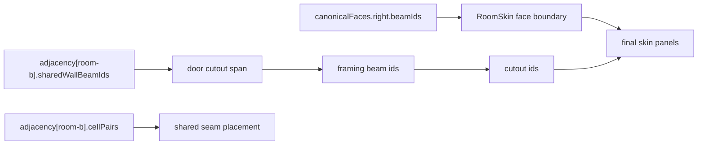

# Orchestrator Cutout Sync

Status: structural owner complete; Nietzsche unblocked for framing/cutouts

## Structural owner status

- Deterministic cell/beam graph: complete
- Canonical face contract: complete
- Adjacency metadata contract: complete
- Query helpers for RoomSkin/selection overlays: complete
- Remaining work in structural area: none required for cutouts

## Nietzsche execution contract

Nietzsche should treat the structural layer as read-only and compose framing/cutout data on top of it.

Primary inputs:

- `shape.structuralRoom.canonicalFaces[face].beamIds`
- `shape.structuralRoom.canonicalFaces[face].adjacentRoomIds`
- `shape.structuralRoom.adjacency[neighborRoomId].sharedWallBeamIds`
- `shape.structuralRoom.adjacency[neighborRoomId].cellPairs`
- `shape.structuralRoom.beams`

Primary rule:

- framing ids and cutout ids must reference existing structural beam ids; they must not replace or rewrite them

## Cutout unblock path

1. Choose a target face from `canonicalFaces[face]`.
2. Use `canonicalFaces[face].beamIds` as the legal outer boundary for RoomSkin panels on that face.
3. If the opening is between rooms, resolve the neighbor with `adjacency[neighborRoomId]`.
4. Use `sharedWallBeamIds` as the cutout-bearing partition span.
5. Use `cellPairs` to choose the exact shared seam for door placement.
6. Emit framing beam ids that reference those wall beam ids.
7. Emit cutout ids that reference framing beam ids plus the owning canonical face id.
8. Have RoomSkin subtract or skip the cutout region while preserving the original structural beam loop.

## Selection overlay unblock path

- Default overlay anchor: `structuralRoom.canonicalFace`
- Explicit face overlays: `structuralRoom.canonicalFaces[face]`
- Shared-wall overlays: derive from `adjacency[neighborRoomId].sharedWallBeamIds`
- Interior/exterior suppression: use `canonicalFaces[face].adjacentRoomIds.length`

## Example mapping

## Orchestrator report

- Structural contract final: yes
- Cutout blocker on structural side: none
- Required Nietzsche follow-through: framing beam composition, cutout emission, RoomSkin subtraction, selection overlay consumption
